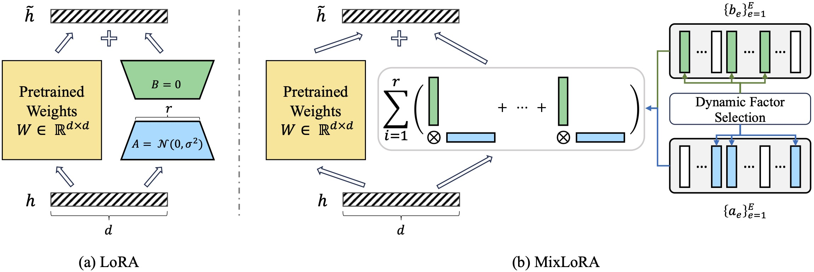

<h2 align="center"> <a href="https://arxiv.org/abs/2402.15896">Multimodal Instruction Tuning with Conditional Mixture of LoRA (ACL 2024)</a></h2>


<p align="center">

</p>

## Requirements and Installation

To set up your environment, run the following commands:
```Shell
conda create -n mixlora python=3.8 -y
conda activate mixlora
sh setup.sh
```

## Data Preparation

### Training Dataset
Please download the dataset from [Vision-Flan](https://vision-flan.github.io/).

### Evaluation Datset
The evaluation dataset we used can be downloaded from [here](https://drive.google.com/drive/folders/1skW50xbEzYeAcwd0Ynld0HaW4Hq0p01B?usp=sharing).

## Training & Inference

Specify the `image_folder` and `data_path` in the fine-tuning scripts according to the data preparation.

### Training

To fine-tune the mode, run the following command:
```
sh scripts/finetune_mixlora.sh <routing-type> <num-experts> <num-rank>
```
- `<routing-type>`: Specify the type of routing (`input` for instance-based IFS routing alone, `input_lora_a_param` for combined instance-based IFS routing and CFS routing).
- `<num-experts>`: Specify the number of factors.
- `<num-rank>`: Specify the number of rank.

> The projector weights `mm_projector.bin` can be downloaded from the original [LLava repo](https://github.com/haotian-liu/LLaVA/blob/main/docs/MODEL_ZOO.md).

> The trained model checkpoints can be found from [here](https://huggingface.co/collections/yingss/mixlora-66adb3b9f0bb529189b1a7a8).

### Inference

To run inference on all the multimodal tasks:
```
sh scripts/run_eval.sh <model-path> <data-dir>
```
- `<model-path>`: Specify the path to the model
- `<data-dir>`: Specify the path to the evaluation dataset

To run inference on MME:
```
sh scripts/run_eval_mme.sh <model-path> <data-dir>
```
- `<model-path>`: Specify the path to the model
- `<data-dir>`: Specify the path to the MME dataset

## Acknowledgement

The codebase is built upon [LLaVA](https://github.com/haotian-liu/LLaVA). We would like to thank the authors for publicly releasing their code.

##  Citation
```
@article{shen2024multimodal,
  title={Multimodal Instruction Tuning with Conditional Mixture of LoRA},
  author={Shen, Ying and Xu, Zhiyang and Wang, Qifan and Cheng, Yu and Yin, Wenpeng and Huang, Lifu},
  journal={arXiv preprint arXiv:2402.15896},
  year={2024}
}
```